# PolyglotLink Architecture

This document describes the system architecture, component interactions, and data flow of PolyglotLink.

## System Overview

PolyglotLink is a semantic API translator for IoT device ecosystems. It provides a unified semantic layer that automatically translates heterogeneous device protocols and data formats into a normalized, semantically-enriched message format.

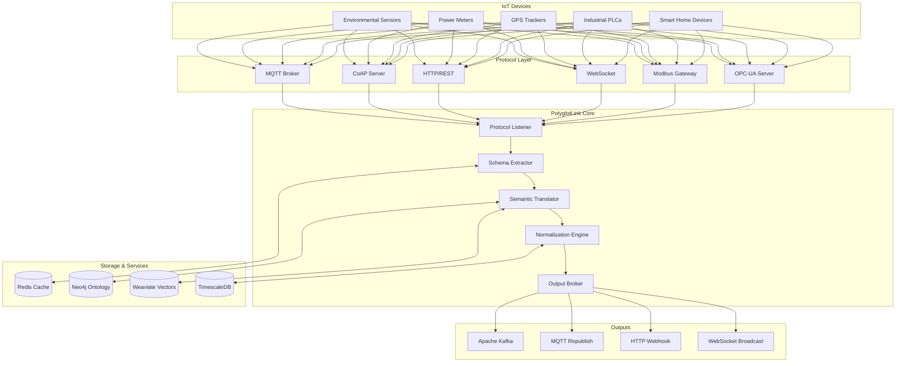

## Component Architecture

### Core Components

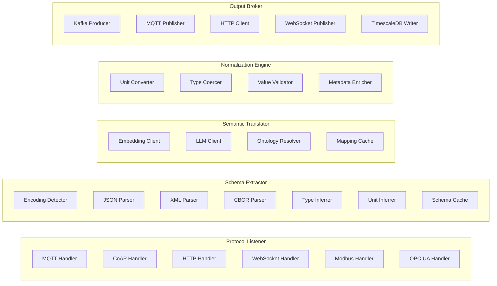

## Data Flow

### Message Processing Pipeline

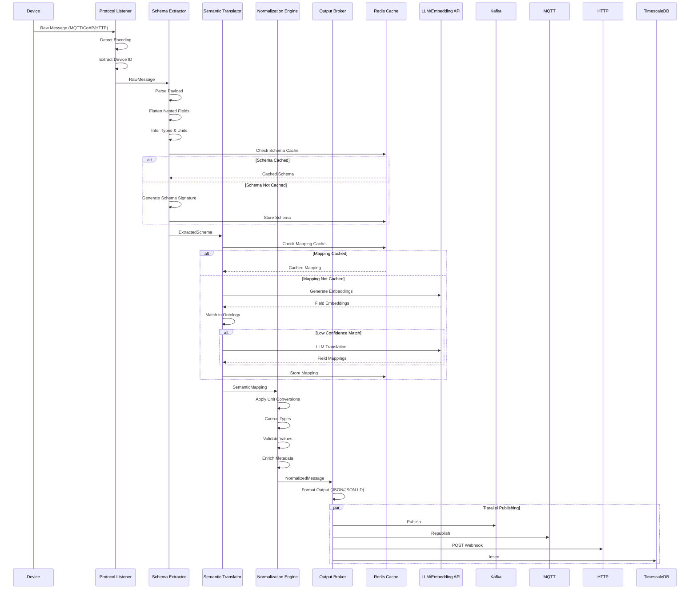

### Schema Detection Flow

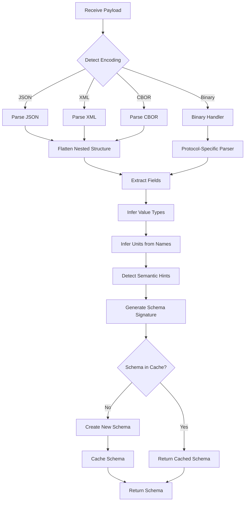

### Semantic Translation Flow

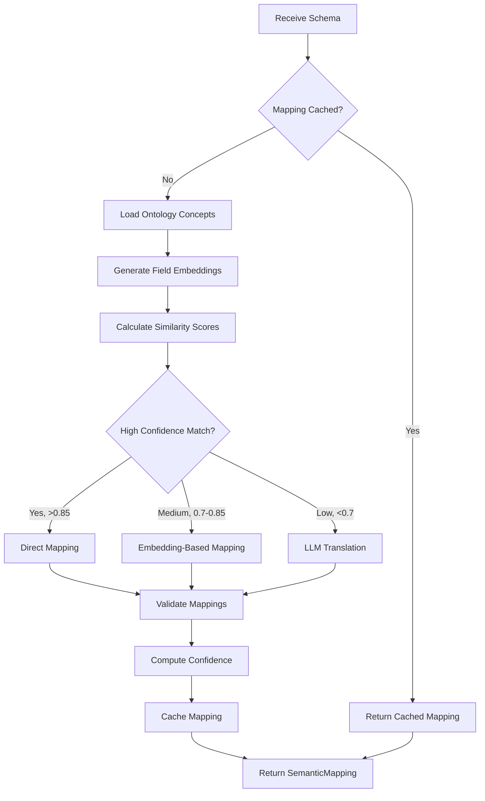

## Deployment Architecture

### Kubernetes Deployment

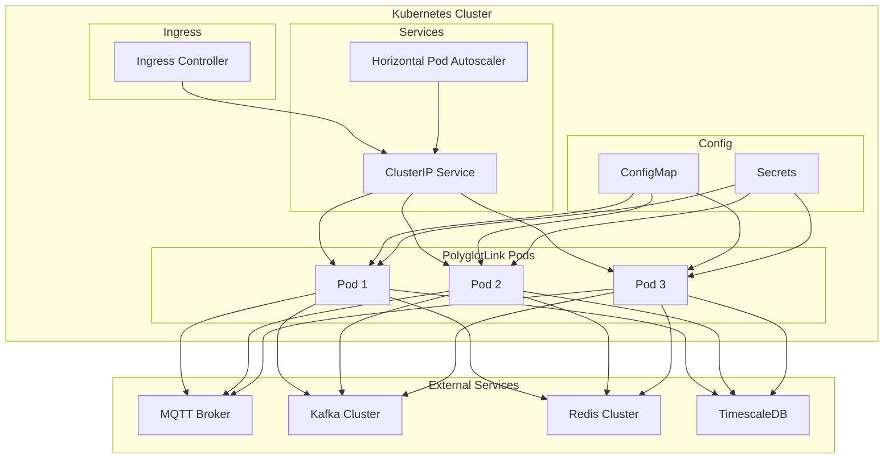

### Docker Compose Stack

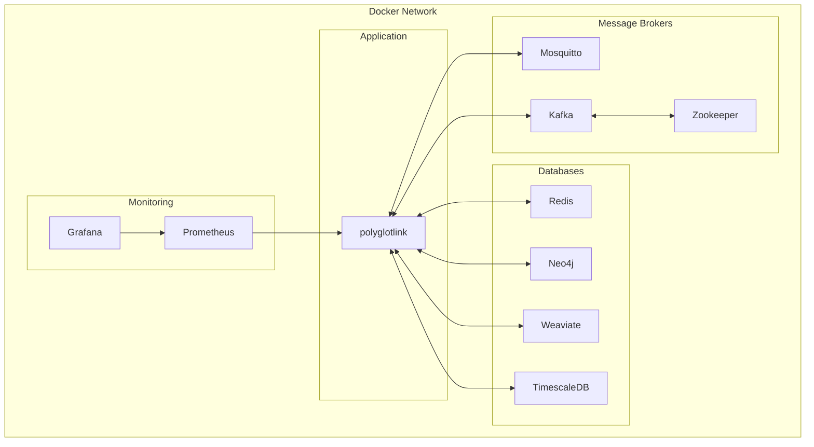

## Data Models

### Message Flow Data Structures

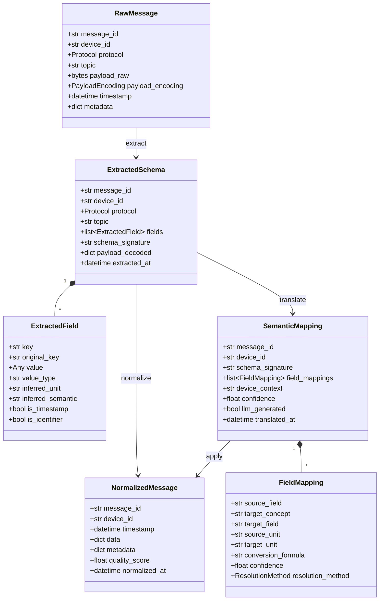

## Caching Strategy

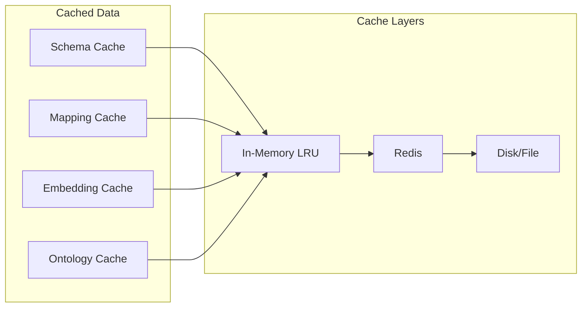

## Error Handling Flow

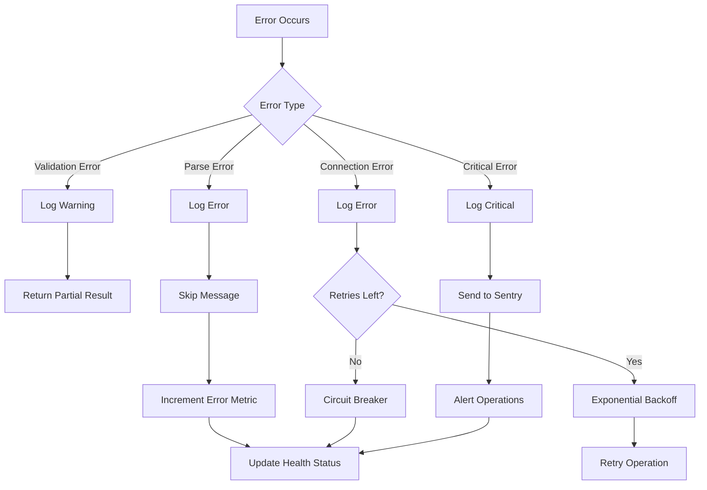

## Metrics Collection

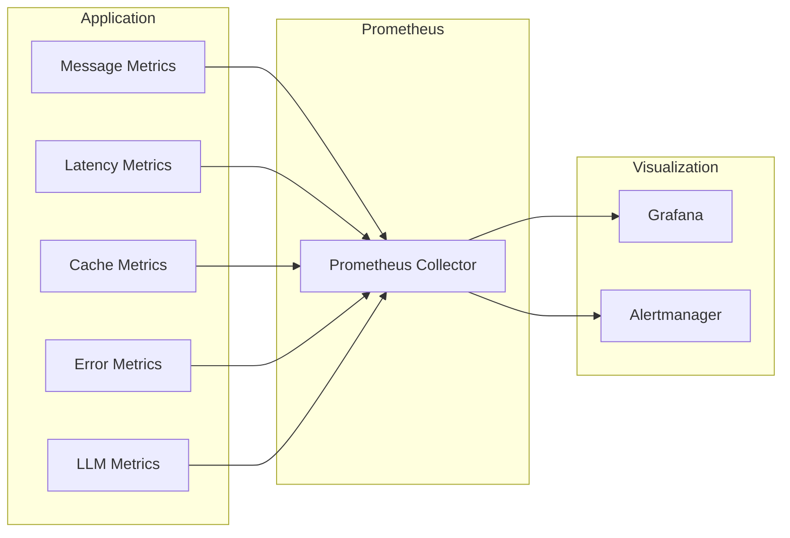

## Security Architecture

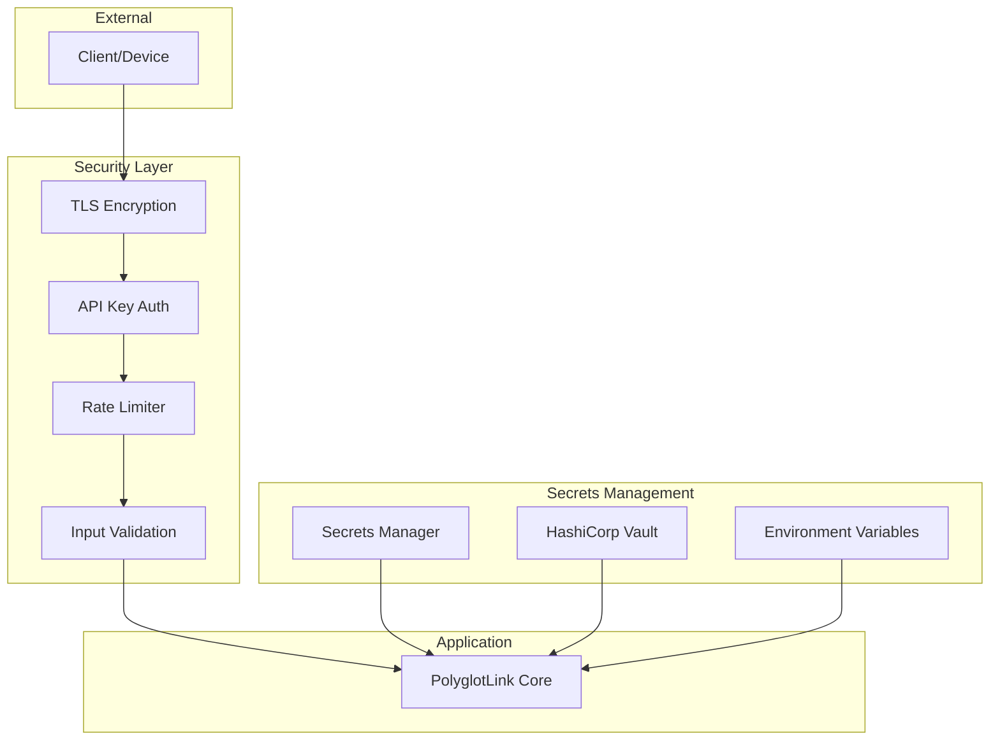
